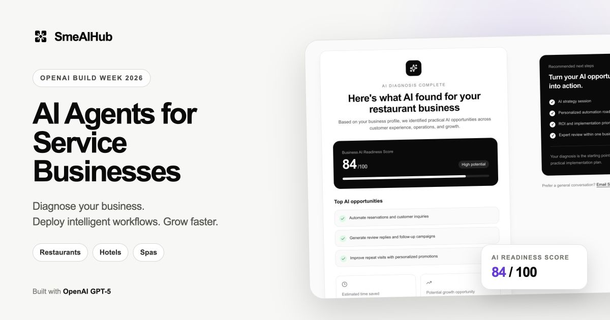
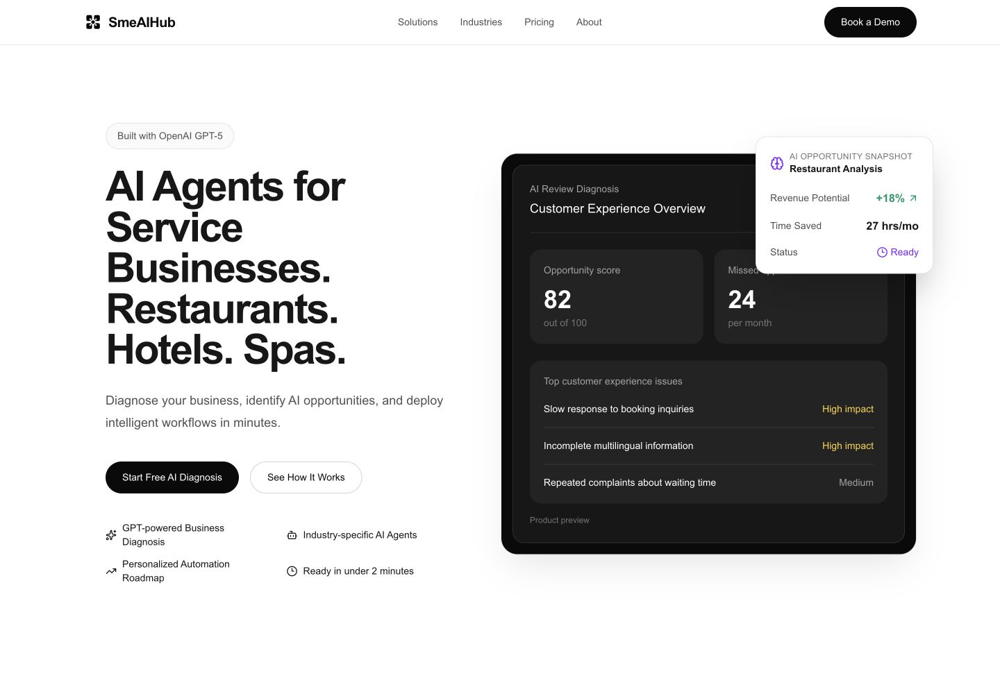
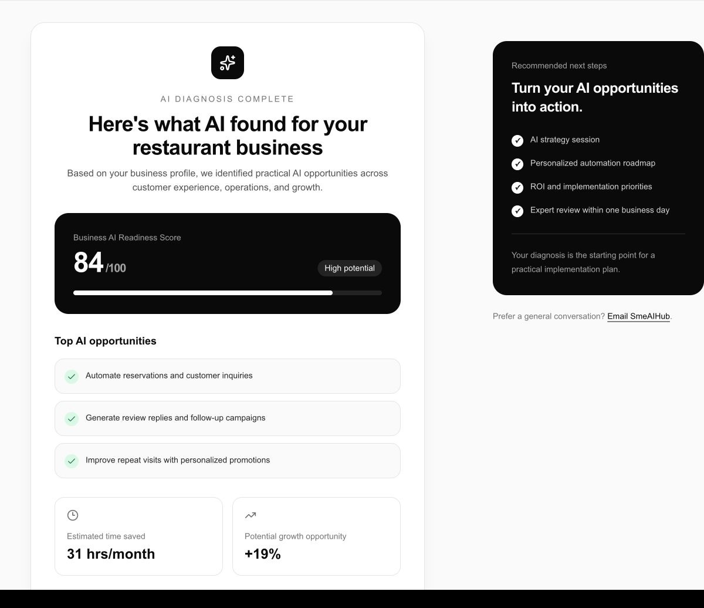
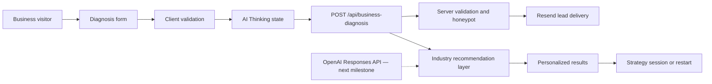

# SmeAIHub



> AI agents for restaurants, hotels, spas, and service businesses — diagnose opportunities, automate customer workflows, and grow faster.

Built for **OpenAI Build Week 2026**.

[Live website](https://smeaihub.ai) · [Try the AI Business Diagnosis](https://smeaihub.ai/demo) · [Watch the Build Week demo](./public/submission/smeaihub-build-week-demo.mp4) · [View the repository](https://github.com/uandai27/SmeAIHub)

## The problem

Small and medium-sized service businesses lose time and revenue to repetitive customer questions, fragmented booking workflows, inconsistent follow-up, and limited operational visibility.

Most AI products still require these businesses to understand models, prompts, integrations, and automation tooling before they can see value. SmeAIHub starts with the business instead: it identifies practical opportunities first, then turns them into an implementation roadmap.

## The product

The Build Week prototype delivers a complete diagnosis journey:

1. A business shares its industry, locations, biggest challenge, and growth goal.
2. The interface communicates the analysis process through a dedicated AI Thinking state.
3. SmeAIHub returns an industry-specific readiness score and prioritized opportunities.
4. The report estimates potential time savings and growth impact.
5. The visitor can book a strategy session or start another diagnosis.

### What works today

- AI-first landing page with a product dashboard preview
- Responsive AI Business Diagnosis form with client and server validation
- Dedicated analysis state and results experience
- Industry-specific results for restaurants, hotels, and spa and wellness businesses
- AI readiness score, opportunity recommendations, time-saved estimate, and growth estimate
- Results-aware supporting content across form, analysis, and report states
- Lead delivery through Resend
- Google Analytics and Microsoft Clarity behind explicit consent
- Same-origin validation, payload limits, honeypot protection, and HTML escaping
- Production metadata, Open Graph image, sitemap, robots, manifest, privacy, and terms pages

## Product experience

### Build Week homepage



### AI Diagnosis Results



### Demo video

[Watch the public 1 minute 40 second Build Week product demo on YouTube](https://youtu.be/iRyJbM6pD50) · [Download captions](./public/submission/smeaihub-build-week-demo.srt) · [Download the source video](./public/submission/smeaihub-build-week-demo.mp4)

## OpenAI, GPT-5.6 Sol, and Codex

SmeAIHub was designed and built with **GPT-5.6 Sol through Codex** as an active product and engineering collaborator. GPT-5.6 Sol supported product positioning, information architecture, interaction design, implementation planning, code iteration, review, and submission preparation.

The current public diagnosis prototype uses a deterministic, industry-specific recommendation layer. It does **not** send submitted business information to an OpenAI model at runtime. This keeps the Build Week demo predictable, reviewable, and privacy-conscious while the product workflow is validated.

The next runtime milestone is an OpenAI-powered diagnosis service using:

- the OpenAI Responses API for business analysis;
- Structured Outputs for reliable scores, opportunities, and implementation priorities;
- industry context and business goals supplied with explicit data minimization;
- deterministic validation and guardrails around model-generated recommendations;
- traceable explanations so business owners can understand why an opportunity was recommended.

This approach keeps the product experience working today while establishing a clear path from the validated prototype to a genuinely intelligent AI advisory layer.

## Architecture



The application keeps the marketing page and metadata server-rendered while isolating the interactive diagnosis flow inside a focused Client Component boundary.

## Technology

| Area | Technology |
|---|---|
| Framework | Next.js 16 App Router |
| UI | React 19, TypeScript, Tailwind CSS 4 |
| Icons | Lucide React |
| Lead delivery | Resend |
| Analytics | Google Analytics, Microsoft Clarity |
| SEO | Next.js Metadata API, sitemap, robots, web manifest |
| Deployment target | Vercel |

## Run locally

### Requirements

- Node.js 20+
- npm
- A Resend API key if you want diagnosis submissions to send email

### Setup

```bash
git clone https://github.com/uandai27/SmeAIHub.git
cd SmeAIHub
npm install
cp .env.example .env.local
```

Add the following value to `.env.local`:

```bash
RESEND_API_KEY=your_resend_api_key
```

Start the development server:

```bash
npm run dev
```

Open [http://localhost:3000](http://localhost:3000).

## Quality checks

```bash
npm run lint
npm run build
```

The Build Week submission is validated against ESLint, TypeScript, the Next.js production build, desktop layout at 1440 px, and mobile layout at 390 px.

## Roadmap

- [x] AI-first marketing experience
- [x] AI Business Diagnosis flow
- [x] Industry-specific results
- [x] Build Week screenshots and social cover
- [ ] OpenAI Responses API integration
- [ ] Structured, model-generated diagnosis reports
- [ ] Streaming analysis progress
- [ ] Downloadable implementation roadmap
- [ ] Dashboard workspace and agent deployment

## Product principles

- **Business-first:** start with operational problems, not model configuration.
- **Human-centered:** AI supports teams and preserves human control.
- **Explainable:** recommendations should be practical and reviewable.
- **Privacy-conscious:** minimize business data and require analytics consent.
- **Incremental:** ship stable, measurable improvements instead of speculative complexity.

## Documentation

Project vision, design language, reviews, decisions, roadmap, and changelog are maintained in [`docs/`](./docs/README.md).

## License

SmeAIHub is released under the [MIT License](./LICENSE).

---

**SmeAIHub** — every service business deserves an intelligent workforce.
